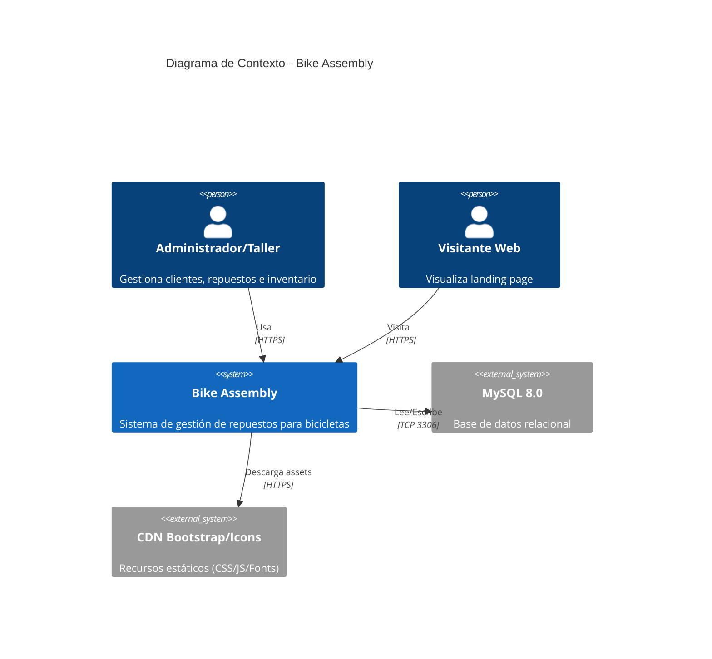
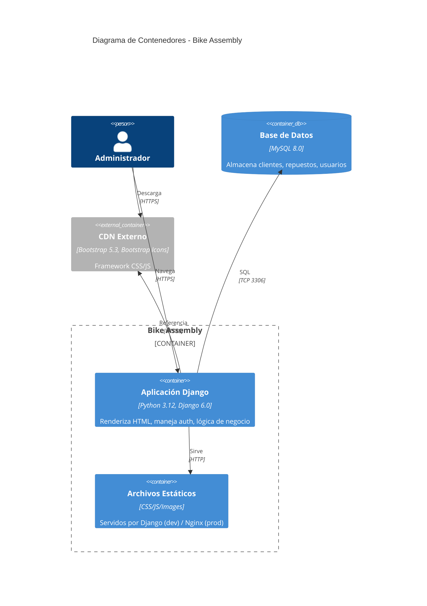
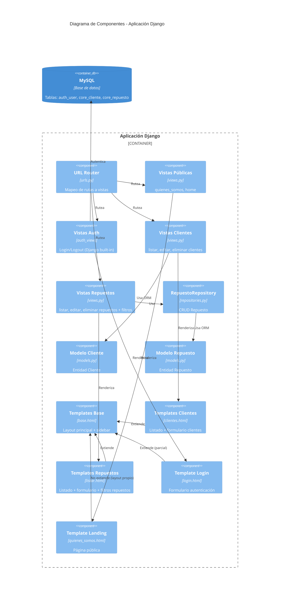
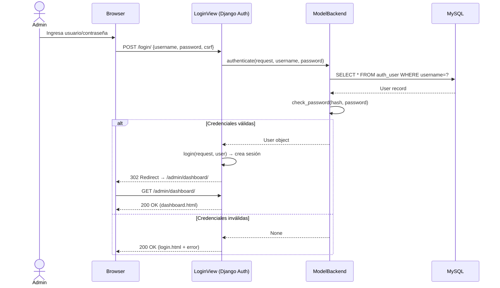
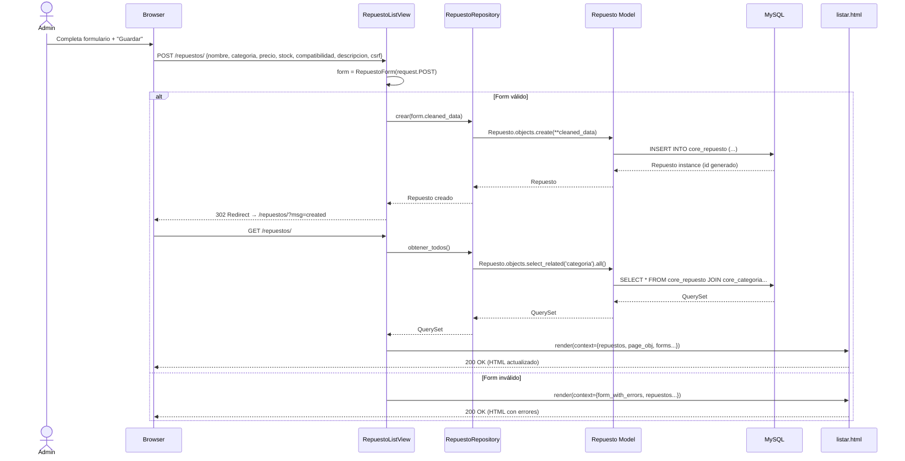
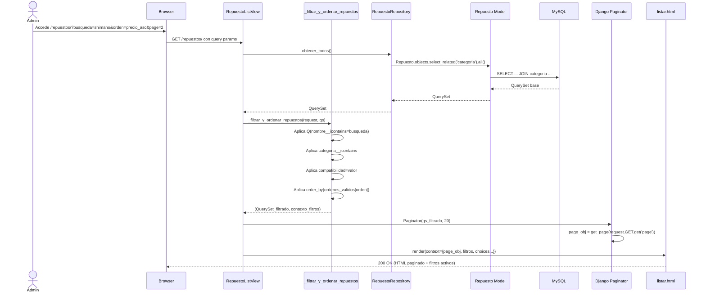
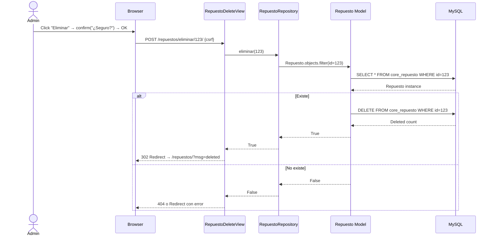

# Documento de Especificación de Arquitectura (DEA)
## Bike Assembly - Sistema de Gestión de Repuestos

---

## 1. Visión General del Sistema

### 1.1 Propósito
Sistema web para la gestión administrativa de un taller/negocio de ensamblaje de bicicletas, permitiendo:
- Administración de clientes (CRUD)
- Catálogo de repuestos con filtros, búsqueda y ordenamiento
- Control de inventario (stock, precios, compatibilidad)

### 1.2 Alcance
- **Módulo Público**: Landing page informativa (`/`)
- **Módulo de Autenticación**: Login/Logout basado en Django Auth
- **Módulo Admin - Clientes**: Gestión completa de clientes
- **Módulo Admin - Repuestos**: Catálogo con filtros avanzados

### 1.3 Stakeholders
| Rol | Descripción | Acceso |
|-----|-------------|--------|
| Administrador/Taller | Gestión completa del sistema | Todos los módulos |
| Cliente final | Solo landing page | Público |

---

## 2. Arquitectura Técnica

### 2.1 Estilo Arquitectónico
**Arquitectura Monolítica Modular** basada en Django MTV (Model-Template-View):
- **Model**: `core/models.py` - Entidades de dominio persistidas en MySQL
- **Template**: `core/templates/` - Vistas HTML renderizadas server-side (Bootstrap 5)
- **View**: `core/views.py` - Controladores FBV (Function-Based Views) con lógica de presentación y negocio
- **Repository**: `core/repositories.py` - Capa de acceso a datos (parcial, solo Repuesto)

### 2.2 Diagrama de Contexto (C4 Level 1)



### 2.3 Diagrama de Contenedores (C4 Level 2)



### 2.4 Diagrama de Componentes (C4 Level 3)



---

## 3. Modelo de Datos

### 3.1 Diagrama Entidad-Relación

```mermaid
erDiagram
    USER ||--o{ CLIENTE : "crea"
    USER ||--o{ REPUESTO : "crea"
    
    CLIENTE {
        bigint id PK
        varchar(100) nombre
        varchar(254) email UK
        varchar(20) telefono
        varchar(200) direccion
        datetime fecha_registro
        datetime fecha_actualizacion
    }
    
    REPUESTO {
        bigint id PK
        varchar(100) nombre
        varchar(50) categoria
        decimal(10,2) precio
        int stock
        char(1) compatibilidad
        text descripcion
        datetime fecha_registro
        datetime fecha_actualizacion
    }
    
    CATEGORIA {
        bigint id PK
        varchar(50) nombre UK
        text descripcion
    }
    
    REPUESTO }|--|| CATEGORIA : "pertenece"
```

### 3.2 Diccionario de Datos

#### Tabla `core_cliente`
| Campo | Tipo | Restricciones | Descripción |
|-------|------|---------------|-------------|
| id | BIGINT | PK, Auto | Identificador único |
| nombre | VARCHAR(100) | NOT NULL | Nombre completo del cliente |
| email | VARCHAR(254) | NOT NULL, UNIQUE | Email único (login/contacto) |
| telefono | VARCHAR(20) | NULL | Teléfono de contacto |
| direccion | VARCHAR(200) | NULL | Dirección de residencia |
| fecha_registro | DATETIME | NOT NULL, AUTO | Timestamp de creación |
| fecha_actualizacion | DATETIME | AUTO | Timestamp de última modificación |

#### Tabla `core_repuesto`
| Campo | Tipo | Restricciones | Descripción |
|-------|------|---------------|-------------|
| id | BIGINT | PK, Auto | Identificador único |
| nombre | VARCHAR(100) | NOT NULL | Nombre del componente |
| categoria_id | BIGINT | FK → categoria.id | Categoría del repuesto |
| precio | DECIMAL(10,2) | NOT NULL, >=0 | Precio de venta |
| stock | INT | DEFAULT 0, >=0 | Unidades disponibles |
| compatibilidad | CHAR(1) | NOT NULL, IN (S,T,U) | S=Ruta, T=Todo Terreno, U=Universal |
| descripcion | TEXT | NULL | Detalles técnicos |
| fecha_registro | DATETIME | NOT NULL, AUTO | Timestamp de creación |
| fecha_actualizacion | DATETIME | AUTO | Timestamp de última modificación |

#### Tabla `core_categoria` (Nueva - Normalización)
| Campo | Tipo | Restricciones | Descripción |
|-------|------|---------------|-------------|
| id | BIGINT | PK, Auto | Identificador único |
| nombre | VARCHAR(50) | NOT NULL, UNIQUE | Nombre de categoría |
| descripcion | TEXT | NULL | Descripción opcional |

---

## 4. Casos de Uso

### 4.1 Actores y Casos de Uso

```mermaid
useCase
    left to right direction
    actor "Administrador" as Admin
    actor "Visitante" as Visit
    
    package "Módulo Público" {
        usecase "Ver Landing Page" as UC1
    }
    
    package "Módulo Autenticación" {
        usecase "Iniciar Sesión" as UC2
        usecase "Cerrar Sesión" as UC3
    }
    
    package "Módulo Clientes" {
        usecase "Listar Clientes" as UC4
        usecase "Buscar/Filtrar Clientes" as UC5
        usecase "Registrar Cliente" as UC6
        usecase "Editar Cliente" as UC7
        usecase "Eliminar Cliente" as UC8
    }
    
    package "Módulo Repuestos" {
        usecase "Listar Repuestos" as UC9
        usecase "Buscar Repuestos" as UC10
        usecase "Filtrar por Categoría" as UC11
        usecase "Filtrar por Compatibilidad" as UC12
        usecase "Ordenar Repuestos" as UC13
        usecase "Registrar Repuesto" as UC14
        usecase "Editar Repuesto" as UC15
        usecase "Eliminar Repuesto" as UC16
        usecase "Ver Stock Bajo" as UC17
    }
    
    Visit --> UC1
    Admin --> UC2
    Admin --> UC3
    Admin --> UC4
    Admin --> UC5
    Admin --> UC6
    Admin --> UC7
    Admin --> UC8
    Admin --> UC9
    Admin --> UC10
    Admin --> UC11
    Admin --> UC12
    Admin --> UC13
    Admin --> UC14
    Admin --> UC15
    Admin --> UC16
    Admin --> UC17
```

### 4.2 Descripción Detallada de Casos de Uso Críticos

#### UC-06: Registrar Cliente
| Campo | Descripción |
|-------|-------------|
| **Actor Principal** | Administrador |
| **Precondición** | Usuario autenticado, en `/admin/clientes/` |
| **Flujo Principal** | 1. Admin completa formulario (nombre, email, teléfono, dirección)<br>2. Sistema valida server-side (ModelForm)<br>3. Sistema verifica email único<br>4. Sistema crea registro en BD<br>5. Sistema redirige a listado con mensaje éxito |
| **Flujos Alternativos** | 2a. Email duplicado → Error "Email ya registrado"<br>2b. Datos inválidos → Errores de validación en formulario |
| **Postcondición** | Cliente creado, visible en listado |

#### UC-14: Registrar Repuesto
| Campo | Descripción |
|-------|-------------|
| **Actor Principal** | Administrador |
| **Precondición** | Usuario autenticado, en `/repuestos/` |
| **Flujo Principal** | 1. Admin completa formulario (nombre, categoría, precio, stock, compatibilidad, descripción)<br>2. Sistema valida server-side (precio ≥ 0, stock ≥ 0)<br>3. Sistema crea registro en BD vía Repository<br>4. Sistema redirige a listado con mensaje éxito |
| **Flujos Alternativos | 2a. Precio/stock negativo → Error validación<br>2b. Categoría nueva → Se crea automáticamente (get_or_create) |

#### UC-09/10/11/12/13: Listar Repuestos con Filtros
| Campo | Descripción |
|-------|-------------|
| **Actor Principal** | Administrador |
| **Precondición** | Usuario autenticado |
| **Flujo Principal** | 1. Admin accede a `/repuestos/`<br>2. Sistema muestra tabla paginada (20 items)<br>3. Admin puede: buscar por texto, filtrar categoría, filtrar compatibilidad, ordenar (6 opciones)<br>4. Sistema aplica filtros en BD (QuerySet)<br>5. Sistema renderiza resultados paginados |
| **Reglas de Negocio** | - Stock ≤ 5: badge rojo "bajo stock"<br>- Stock = 0: badge "agotado"<br>- Paginación: 20 por página |

---

## 5. Historias de Usuario

### 5.1 Épicas

| Épica | Descripción |
|-------|-------------|
| **E1: Autenticación** | Acceso seguro al sistema administrativo |
| **E2: Gestión de Clientes** | CRUD completo de clientes con validaciones |
| **E3: Catálogo de Repuestos** | Inventario con búsqueda, filtros, ordenamiento y alertas de stock |
| **E4: Experiencia de Usuario** | Interfaz responsive, accesible y consistente |

### 5.2 Historias de Usuario Detalladas

#### E1: Autenticación
| ID | Historia | Criterios de Aceptación | Prioridad |
|----|----------|-------------------------|-----------|
| HU-01 | Como administrador, quiero iniciar sesión con usuario/contraseña para acceder al panel | - Formulario con validación<br>- Redirección a dashboard tras login<br>- Mensaje error si credenciales inválidas<br>- Rate limiting (5 intentos/15 min) | 🔴 Crítica |
| HU-02 | Como administrador, quiero cerrar sesión para proteger mi cuenta | - Botón logout en sidebar<br>- Redirección a login<br>- Sesión invalidada | 🔴 Crítica |

#### E2: Gestión de Clientes
| ID | Historia | Criterios de Aceptación | Prioridad |
|----|----------|-------------------------|-----------|
| HU-03 | Como admin, quiero ver lista paginada de clientes para gestionar muchos registros | - 25 por página<br>- Columnas: nombre, email, teléfono, dirección, acciones<br>- Orden por fecha registro desc | 🔴 Crítica |
| HU-04 | Como admin, quiero buscar clientes por nombre/email para encontrar rápido | - Búsqueda en tiempo real (AJAX) o submit<br>- Coincidencia parcial case-insensitive | 🟠 Alta |
| HU-05 | Como admin, quiero registrar nuevo cliente con validaciones | - Nombre: solo letras/espacios<br>- Email: formato válido + único<br>- Teléfono: 10 dígitos<br>- Dirección: min 5 chars | 🔴 Crítica |
| HU-06 | Como admin, quiero editar cliente existente | - Formulario pre-poblado<br>- Validaciones idem registro<br>- Confirmación visual de cambios | 🟠 Alta |
| HU-07 | Como admin, quiero eliminar cliente con confirmación | - Modal/confirm nativo<br>- Soft delete preferido<br>- No eliminar si tiene pedidos (futuro) | 🟠 Alta |

#### E3: Catálogo de Repuestos
| ID | Historia | Criterios de Aceptación | Prioridad |
|----|----------|-------------------------|-----------|
| HU-08 | Como admin, quiero ver catálogo paginado de repuestos | - 20 por página<br>- Columnas: nombre, categoría, precio, compatibilidad, stock, acciones<br>- Badge color según stock | 🔴 Crítica |
| HU-09 | Como admin, quiero buscar repuestos por nombre/descripción | - Búsqueda full-text en BD<br>- Debounce 300ms (AJAX) | 🟠 Alta |
| HU-10 | Como admin, quiero filtrar por categoría | - Dropdown/input con categorías existentes<br>- Filtro exacto o parcial | 🟠 Alta |
| HU-11 | Como admin, quiero filtrar por compatibilidad (S/T/U) | - Select con 3 opciones + "Todas"<br>- Filtro exacto en BD | 🟠 Alta |
| HU-12 | Como admin, quiero ordenar por precio/nombre/stock | - 6 opciones: nombre↑↓, precio↑↓, stock↑↓<br>- Persistir en URL (compartible) | 🟠 Alta |
| HU-13 | Como admin, quiero registrar repuesto con validaciones | - Precio ≥ 0, Stock ≥ 0<br>- Categoría: select existente + nueva<br>- Compatibilidad: obligatoria | 🔴 Crítica |
| HU-14 | Como admin, quiero ver alertas de stock bajo | - Stock ≤ 5: badge rojo "bajo stock"<br>- Stock = 0: badge "agotado"<br>- Filtro "solo stock bajo" | 🟡 Media |

#### E4: Experiencia de Usuario
| ID | Historia | Criterios de Aceptación | Prioridad |
|----|----------|-------------------------|-----------|
| HU-15 | Como usuario móvil, quiero navegar sin sidebar fijo | - Hamburger menu → drawer lateral<br>- Touch-friendly (44px targets)<br>- No scroll horizontal | 🔴 Crítica |
| HU-16 | Como usuario, quiero feedback visual tras acciones | - Toast/snackbar: "Guardado", "Eliminado", "Error"<br>- Auto-dismiss 3s<br>- Accesible (aria-live) | 🟠 Alta |
| HU-17 | Como usuario con discapacidad, quiero navegar por teclado | - Focus visible en todos elementos<br>- Skip link "Saltar al contenido"<br>- ARIA labels en iconos/botones | 🟡 Media |
| HU-18 | Como admin, quiero diseño consistente en todas páginas | - Template base único<br>- Sidebar/nav unificado<br>- Paleta Nexora (azul/oro) | 🟠 Alta |

---

## 6. Diagramas de Secuencia

### 6.1 Secuencia: Login Exitoso



### 6.2 Secuencia: Registrar Repuesto (POST)



### 6.3 Secuencia: Listar Repuestos con Filtros (GET)



### 6.4 Secuencia: Eliminar Repuesto



---

## 7. Diagramas de Flujo (Flowcharts)

### 7.1 Flujo: Procesamiento Request Genérico (CBV)

```mermaid
flowchart TD
    A[Request HTTP] --> B{URL Match?}
    B -->|No| C[404 Not Found]
    B -->|Sí| D[Middleware Chain]
    D --> E{Autenticado?}
    E -->|No + login_required| F[Redirect /login/?next=...]
    E -->|Sí| G[View.dispatch]
    G --> H{Método HTTP}
    H -->|GET| I[get() / get_context_data]
    H -->|POST| J[post() / form_valid]
    I --> K[Queryset + Filtros + Paginación]
    J --> L[Form Validation]
    L -->|Inválido| M[Render con errores]
    L -->|Válido| N[Save + Messages]
    N --> O[Redirect GET]
    K --> P[Render Template]
    P --> Q[Response HTML]
    M --> Q
    O --> Q
    C --> Q
    F --> Q
```

### 7.2 Flujo: Validación y Creación de Repuesto

```mermaid
flowchart TD
    A[POST /repuestos/] --> B[RepuestoForm(data=request.POST)]
    B --> C{form.is_valid?}
    C -->|No| D[Recopilar errores de campo]
    D --> E[Render listar.html con form.errors]
    C -->|Sí| F[cleaned_data = form.cleaned_data]
    F --> G[Repo.crear(cleaned_data)]
    G --> H{Exception?}
    H -->|IntegrityError| I[Error: duplicado/constraint]
    H -->|DB Error| J[Error 500 + logging]
    H -->|OK| K[Repuesto instance]
    K --> L[messages.success('Creado')]
    L --> M[Redirect /repuestos/]
    I --> E
    J --> E
```

### 7.3 Flujo: Filtrado y Ordenamiento de Repuestos

```mermaid
flowchart TD
    A[_filtrar_y_ordenar_repuestos(request, qs)] --> B[busqueda = request.GET.get('busqueda')]
    B --> C{busqueda?}
    C -->|Sí| D[qs = qs.filter(Q(nombre__icontains=b) | Q(descripcion__icontains=b))]
    C -->|No| E[qs sin cambios]
    D --> F[categoria_filtro = request.GET.get('categoria_filtro')]
    E --> F
    F --> G{categoria_filtro?}
    G -->|Sí| H[qs = qs.filter(categoria__icontains=cat)]
    G -->|No| I[qs sin cambios]
    H --> J[compatibilidad_filtro = request.GET.get('compatibilidad_filtro')]
    I --> J
    J --> K{compatibilidad_filtro?}
    K -->|Sí| L[qs = qs.filter(compatibilidad=compat)]
    K -->|No| M[qs sin cambios]
    L --> N[orden = request.GET.get('orden')]
    M --> N
    N --> O{orden en ordenes_validos?}
    O -->|Sí| P[qs = qs.order_by(ordenes_validos[orden])]
    O -->|No| Q[qs sin orden]
    P --> R[Return qs, contexto_filtros]
    Q --> R
```

---

## 8. Reglas de Negocio

| ID | Regla | Descripción | Implementación |
|----|-------|-------------|----------------|
| RN-01 | Email único | No pueden existir dos clientes con mismo email | `unique=True` en modelo + validación Form |
| RN-02 | Precio no negativo | Precio ≥ 0 | `CheckConstraint(precio__gte=0)` + Form `min_value=0` |
| RN-03 | Stock no negativo | Stock ≥ 0 (evita overselling) | `CheckConstraint(stock__gte=0)` + Form `min_value=0` |
| RN-04 | Compatibilidad válida | Solo S, T, U | `choices=COMPATIBILIDAD_CHOICES` en modelo + Form `ChoiceField` |
| RN-05 | Categoría normalizada | Categoría es FK a tabla categoria | `ForeignKey(Categoria, PROTECT)` |
| RN-06 | Stock bajo alerta | Stock ≤ 5 → visual warning | Template logic: `......` |
| RN-07 | Paginación obligatoria | Listados > 20 items paginados | `Paginator(qs, 20)` en ListView |
| RN-08 | Soft delete preferido | No borrar físicamente si hay relaciones | Futuro: `is_active` + `deleted_at` |
| RN-09 | Rate limit login | Máx 5 intentos / 15 min | `django-axes` configurado |
| RN-10 | Sesión segura | HTTPS only, HttpOnly, SameSite=Lax | Settings: `SESSION_COOKIE_SECURE`, `SESSION_COOKIE_HTTPONLY`, `SESSION_COOKIE_SAMESITE` |

---

## 9. Interfaces Externas

| Interfaz | Protocolo | Descripción |
|----------|-----------|-------------|
| **Navegador → Django** | HTTPS | HTML forms, GET params, AJAX (futuro) |
| **Django → MySQL** | TCP 3306 | SQL queries vía Django ORM (mysqlclient) |
| **Django → CDN** | HTTPS | Bootstrap CSS/JS, Bootstrap Icons (fonts) |
| **Django → Email (futuro)** | SMTP | Notificaciones, recovery password |

---

## 10. Requisitos No Funcionales

| Categoría | Requisito | Métrica Objetivo |
|-----------|-----------|------------------|
| **Rendimiento** | Tiempo respuesta listado (paginado) | < 500ms (p95) |
| **Rendimiento** | Tiempo respuesta formulario POST | < 300ms (p95) |
| **Disponibilidad** | Uptime mensual | 99.9% |
| **Seguridad** | TLS 1.2+ obligatorio | 100% tráfico HTTPS |
| **Seguridad** | Headers de seguridad | CSP, HSTS, X-Frame-Options |
| **Escalabilidad** | Usuarios concurrentes | 100 (actual) → 1000 (objetivo) |
| **Mantenibilidad** | Cobertura tests | > 80% (unit) / > 70% (integración) |
| **Usabilidad** | Accesibilidad | WCAG 2.1 AA |
| **Usabilidad** | Responsive | Breakpoints: 576, 768, 992, 1200px |

---

## 11. Decisiones Arquitectónicas (ADR)

| ADR | Título | Decisión | Consecuencias |
|-----|--------|----------|---------------|
| ADR-001 | Framework Web | Django 6.x (MTV) | Productividad alta, ORM incluido, admin auto |
| ADR-002 | Base de Datos | MySQL 8.0 | ACID, relacional, maduro, team conoce |
| ADR-003 | Frontend | Server-side rendering + Bootstrap 5 | SEO nativo, simple, sin build step JS |
| ADR-004 | Autenticación | Django Auth Built-in | Seguro, probado, extensible |
| ADR-005 | Repository Pattern | Parcial (solo Repuesto) | Separación parcial, migración gradual a Service Layer |
| ADR-006 | Configuración | Variables de entorno (.env) | 12-factor app, secrets fuera de repo |
| ADR-007 | Despliegue | Docker + Gunicorn + Nginx | Reproducible, escalable, estándar industria |
| ADR-008 | Tests | pytest + factory_boy | Moderno, fixtures potentes, parametrizado |

---

## 12. Glosario

| Término | Definición |
|---------|------------|
| **Repuesto** | Componente/parte de bicicleta gestionada en inventario |
| **Compatibilidad** | Tipo de bicicleta: S=Ruta, T=Todo Terreno, U=Universal |
| **Stock Bajo** | Condición: unidades disponibles ≤ 5 |
| **CBV** | Class-Based View (Vista basada en clase) de Django |
| **FBV** | Function-Based View (Vista basada en función) de Django |
| **ORM** | Object-Relational Mapping (Django ORM) |
| **QuerySet** | Colección perezosa de consultas a BD en Django |
| **Paginator** | Utilidad Django para paginación de resultados |
| **ModelForm** | Formulario Django que mapea directo a modelo |
| **CSRF** | Cross-Site Request Forgery (protección tokens) |
| **12-Factor App** | Metodología para apps cloud-native (config en env vars) |